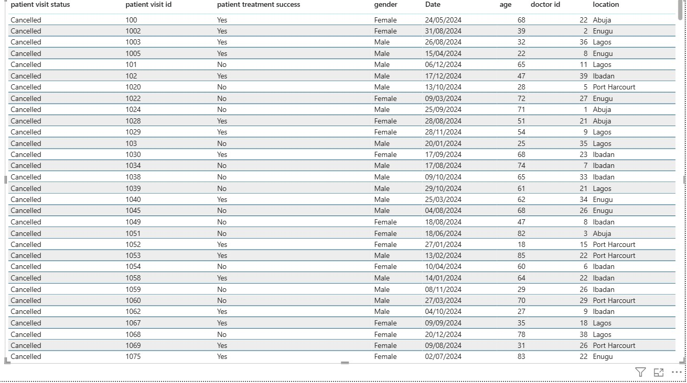

# Hypertension-Patient-Care-Analytics

## Introduction
Hypertension is a major public health condition that requires continuous monitoring, effective treatment, and regular follow-ups to prevent severe complications.
This project analyses hypertension patient care data from a healthcare case study within the healthcare industry. It focuses on patient visit patterns, treatment outcomes, costs, and follow-up needs over a 12 month period.
The aim of this analysis is to generate insights that support better healthcare planning, improved resource allocation, and more effective management of hypertension patients. 
## Problem Statement
Healthcare providers face challenges in managing hypertension patients due to:
- High patient volumes
- Varying treatment effectiveness
- Inconsistent follow-up compliance
- Rising treatment costs
## The key business questions this analysis addresses are:
-	How many patients and visits are being recorded over time?
- How successful are current hypertension treatments?
-	Which severity levels require the most follow-up care?
-	How do treatment costs vary by severity?
-	Are there specific demographic or location-based patterns that affect outcomes?

This analysis aims to provide data-driven insights to support improved hypertension care planning and monitoring.
## Data Sourcing
The dataset used in this project is a simulated healthcare dataset designed for analytical and educational purposes.
## Dataset details:
Source: Simulated healthcare case study
- Time period: January 2014 – December 2014
Key fields include:
- Patient ID
- Patient Visit ID
- Patient Visit date
- Gender
- Age
- Location
- Doctor ID
- Disease
- Hypertension severity level
-	Treatment type
- Treatment cost
- Visit status
- Follow-up Required
- Patient Success Rate
## Data Transformation & Cleaning
Several data preparation steps were performed to ensure accurate analysis:
- Removed duplicate records
- Created unique identifiers for patients,Location and Treatment
-	Standardised date formats and created a date table
-	Categorised patients into age groups
-	Validated treatment cost values
-	Created calculated measures using DAX (e.g. completed visits, treatment success rate, follow-up percentage)
-	Age Group categories were created (e.g. 18–35, 36–50, 51–65, 65+).
  These steps ensured the dataset was clean, consistent, and suitable for analysis in Power BI.
## Data Modelling (Power BI)
A star schema data model was designed to improve performance and simplify analysis.
Model Structure
## Fact Visits
-	Patient Visit ID
-	Patient ID
-	Visit Date
-	Treatment Cost
- Visit Status
- Treatment Id
- Location Id
- Doctor Id
## Dimension Tables
-	Dim_Patient (Patient ID, Gender, Age, Age Group, Severity Level,Follow-up Required)
-	Dim_Date (Date, Month, Year)
-	Dim_Location (Location )
-	Dim_Treatment (Treatment Type, Disease)
-	 Dim Doctor (Doctor Id)
## Analysis & Measures
Key business metrics were calculated using DAX measures.
Core Measures
- Total Visits = COUNT(Fact_Visits[Patient Visit ID])
- Total Patients = DISTINCTCOUNT(Fact_Visits[Patient ID])
- Completed Visits =
   CALCULATE(COUNT('Fact Visits'[patient visit id]),'Fact Visits'[patient visit status] ="Completed")
- Treatment Success Rate =
   DIVIDE(CALCULATE([Total Visits],'Fact Visits'[patient treatment success]= "Yes"),[Total Visits]
- Follow Up Required % =
DIVIDE(CALCULATE([Total Visits],'Dim Patient'[patient follow up required]= "Yes"),[Total Visits])
- Average Treatment Cost =
 AVERAGE(Fact_Visits[Treatment Cost])
## Key Metrics (KPIs)
The following KPIs were developed to measure performance:
-	Total Visits: 3,000
- Total Patients: 499
- Treatment Success Rate: 50%
-	Completed Visits: 1,015
-	Follow-Up Required: 48%
-	Average Treatment Cost: £26K
## Dashboard Overvie

The Power BI dashboard provides insights into:
- Patient visits by month
- Treatment types by visit
- Treatment success rate by age group
- Follow-up requirements by severity level
- Treatment cost by severity
- Patient distribution by gender and location
These visuals enable stakeholders to quickly identify trends, risks, and areas for improvement.
## Slicer
- Gender
## Tools Used
-	Power BI:Power Query Data modelling, DAX, and visualisation.
-	GitHub:Project documentation and version control
  
 ## Key Insights
- Insight 1: Only 50% of patient visits resulted in successful treatment, indicating room for clinical improvement.
- Insight 2: Moderate and severe cases account for the highest follow-up requirements, increasing operational workload.
-	Insight 3: Certain locations (e.g.Ibadan and Lagos) recorded higher visit volumes, suggesting regional demand pressure.
## Recommendations
- Strengthen early intervention strategies for moderate cases to reduce progression to severe hypertension.	
- Allocate more healthcare resources and staff to high-volume locations.
- Improve follow-up management programs to reduce repeat visits and improve treatment outcomes.
## Conclusion
This project delivered a data-driven view of hypertension patient care and treatment performance, enabling healthcare stakeholders to monitor patient outcomes, resource usage, and follow-up needs.
The dashboard supports better decision making around:
	- Treatment effectiveness
	- Patient risk profiling
	- Cost and follow-up management
Future work could include integrating real time patient monitoring data, predictive risk modelling, and outcome forecasting to further enhance clinical decision making.
